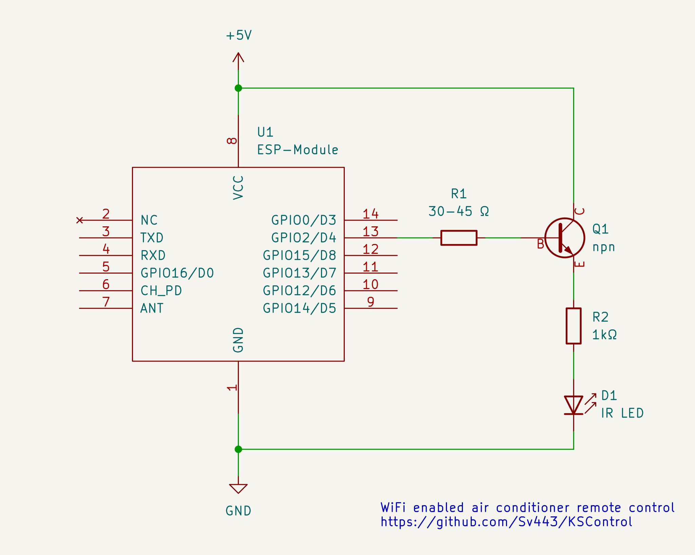

<div align="center" style="text-align:center;">

# KSControl
### WiFi-controlled and autonomous gadget to control the Klarstein NB series A/C

<br>

##### Disclaimer:
##### This was only tested with the NB9 model but it'll probably work with other NB series aircons

</div>

<br><br>

### Table of content:

- [Software installation](#software-installation)
- [Hardware installation](#hardware-installation)
  - [Parts list](#parts-list)
  - [Schematic](#schematic)
- [Server](#server)
  - [Set state](#post-state)
  - [Get state](#get-state)
  - [Errors](#errors)

<br><br><br>

## Software installation:
1. Set up the ESP board and firmware in the Arduino IDE ([follow this guide](https://randomnerdtutorials.com/how-to-install-esp8266-board-arduino-ide/))
2. Clone or download and extract this project and open it with the Arduino IDE
3. Install the following library in the library manager (Sketch > Include library): `ESP_EEPROM` by j-watson
4. Rename the file `settings.h.template` to `settings.h`, enter your WiFi's credentials and edit the other settings to your liking
5. Upload the sketch to the ESP board with the arrow button at the top
6. Open the serial monitor ( <kbd>Ctrl</kbd> + <kbd>Shift</kbd> + <kbd>M</kbd> ) to view information and a live log (make sure the BAUD rate is set to 115200)

<br><br><br>

## Hardware installation:

### Parts list:
- ESP8266 board (or other ESP)
- Infrared LED (100mA, ~1.5V)
- Generic npn transistor
- 30-45 Ω LED resistor (3x 100Ω in parallel or 4x 10Ω in series)
- 1 kΩ transistor resistor

(resistor values are wrong, TODO: correct them lol)

<br>

### Schematic:
<a href="./resources/Schematic/Schematic.svg"></a>

<br><br><br>

## Server:
KSControl spins up an HTTP server on your ESP's WiFi.  
It can be used to remote control the A/C from within your network.  
To access it from anywhere, you can either set up a VPN connection to your network, host a reverse proxy like nginx on a Raspberry Pi, or forward the TCP port 80 in your router's configuration (if you're doing this, make sure your ESP is assigned a static IP in your router's interface).  
  
Use the following routes to talk to KSControl, using its IP address displayed in the Arduino IDE serial monitor.  

<br>

> ### POST `/state`
> All control data (temp, mode, etc) needs to be simultaneously transmitted to the A/C whenever only one value changes, so the ESP keeps track of the current state of the A/C.  
> If a request is sent to this route, the internal state gets updated and sent to the A/C unit via infrared, just like the remote control would.  
>   
> Some values depend on your A/C model's capabilities (some can't heat for example) and will not influence the actual A/C unit's state.  
> However the ESP's state will be updated with whatever you throw at it, so do some validation yourself if needed.  
>   
> To update the state with new values, send a POST request to this route with the following URL parameters.  
> For example: `/state?enabled=true&mode=COOL&temp=18`
> 
> | Key | Type | Possible values |
> | :-- | :-- | :-- |
> | enabled | boolean | true, false |
> | temp | number | 16-30 (in °C) |
> | mode | string | AUTO, COOL, DRY, FAN, HEAT |
> | fan | string | AUTO, LOW, MEDIUM, HIGH |
>   
> This route returns a JSON object that informs you of the success:
> ```json
> {
>   "error": false,
>   "message": "Successfully updated the state"
> }
> ```

<br>

> ### GET `/state`
> This route returns the current state that's set in the ESP as a JSON object.  
> When no state update has been received by the ESP yet, it will return an empty object.  
>   
> Sadly the ESP's state and the actual A/C unit's state can differ, as someone can use the remote or press the buttons on the unit to change its state without the ESP knowing of it.  
> But if you send a request to the [POST /state](#post-state) endpoint with all parameters set, you will make the states consistent again.  
>   
> The returned data could look like this:
> ```json
> {
>   "error": false,
>   "state": {
>     "enabled": true,
>     "temp": 20,
>     "mode": "COOL",
>     "fan": "HIGH"
>   }
> }
> ```

<br>

### Errors
Client errors have the HTTP response codes 4xx, server errors have the codes 5xx.  
Additionally, KSControl will return a JSON object looking like this, informing you what the problem is:
```json
{
  "error": true,
  "message": "Something went wrong"
}
```

<br><br><br>

<div align="center" style="text-align: center;">

Made with ❤️ by [Sv443](https://github.com/Sv443)  
If you like this project, please consider [supporting me](https://github.com/sponsors/Sv443)  
  
© 2022 Sv443 - [MIT license](./LICENSE.txt)

</div>
